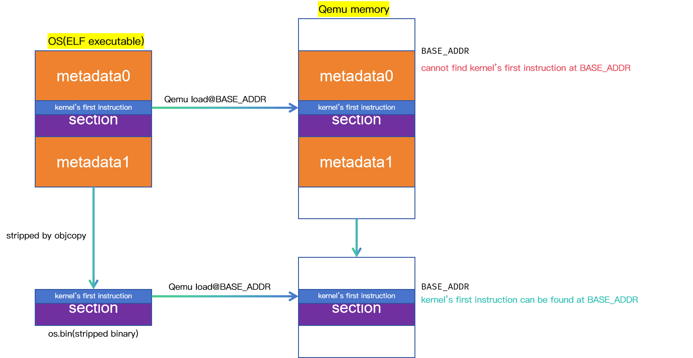

# rCore实验 - Lab1

位于 ch1 分支上项目结构如下所示：

```bash
./os/src
Rust        4 Files   119 Lines
Assembly    1 Files    11 Lines

├── bootloader(内核依赖的运行在 M 特权级的 SBI 实现，本项目中我们使用 RustSBI)
│   └── rustsbi-qemu.bin(可运行在 qemu 虚拟机上的预编译二进制版本)
├── LICENSE
├── os(我们的内核实现放在 os 目录下)
│   ├── Cargo.toml(内核实现的一些配置文件)
│   ├── Makefile
│   └── src(所有内核的源代码放在 os/src 目录下)
│       ├── console.rs(将打印字符的 SBI 接口进一步封装实现更加强大的格式化输出)
│       ├── entry.asm(设置内核执行环境的的一段汇编代码)
│       ├── lang_items.rs(需要我们提供给 Rust 编译器的一些语义项，目前包含内核 panic 时的处理逻辑)
│       ├── linker-qemu.ld(控制内核内存布局的链接脚本以使内核运行在 qemu 虚拟机上)
│       ├── main.rs(内核主函数)
│       └── sbi.rs(调用底层 SBI 实现提供的 SBI 接口)
├── README.md
└── rust-toolchain(控制整个项目的工具链版本)
```

## 应用程序执行环境与平台支持

### 应用程序执行环境

> **应用程序的执行环境**（Execution Environment）是指运行一个应用程序时所需的硬
> 件、软件和配置的整体集合。它为应用程序提供了一个运行的“上下文”，确保程序能
> 正确加载、执行并与外部资源交互。简单来说，执行环境是应用程序运行的“舞台”，
> 包括所有必要的支持系统和条件。


- **白色块**：表示各级执行环境
- **黑色块**：表示相邻两层执行环境之间的接口

### 目标平台与目标三元组

编译器编译、链接得到可执行文件时需要程序要在哪个平台上运行。

```bash
$ rustc --version --verbose
rustc 1.86.0 (05f9846f8 2025-03-31)
binary: rustc
commit-hash: 05f9846f893b09a1be1fc8560e33fc3c815cfecb
commit-date: 2025-03-31
host: x86_64-unknown-linux-gnu
release: 1.86.0
LLVM version: 19.1.7
```
默认平台：`x86_64-unknown-linux-gnu`

- CPU 架构：`x86_64`
- CPU 厂商：`unknown`
- 操作系统：`linux`
- 运行时库：`gnu`

查询目前 Rust 编译器支持哪些基于 RISC-V 的平台：

```bash
$ rustc --print target-list | grep riscv
riscv32-wrs-vxworks
riscv32e-unknown-none-elf
riscv32em-unknown-none-elf
riscv32emc-unknown-none-elf
riscv32gc-unknown-linux-gnu
riscv32gc-unknown-linux-musl
riscv32i-unknown-none-elf
riscv32im-risc0-zkvm-elf
riscv32im-unknown-none-elf
riscv32ima-unknown-none-elf
riscv32imac-esp-espidf
riscv32imac-unknown-none-elf
riscv32imac-unknown-nuttx-elf
riscv32imac-unknown-xous-elf
riscv32imafc-esp-espidf
riscv32imafc-unknown-none-elf
riscv32imafc-unknown-nuttx-elf
riscv32imc-esp-espidf
riscv32imc-unknown-none-elf
riscv32imc-unknown-nuttx-elf
riscv64-linux-android
riscv64-wrs-vxworks
riscv64gc-unknown-freebsd
riscv64gc-unknown-fuchsia
riscv64gc-unknown-hermit
riscv64gc-unknown-linux-gnu
riscv64gc-unknown-linux-musl
riscv64gc-unknown-netbsd
riscv64gc-unknown-none-elf
riscv64gc-unknown-nuttx-elf
riscv64gc-unknown-openbsd
riscv64imac-unknown-none-elf
riscv64imac-unknown-nuttx-elf
```

选择 `riscv64gc-unknown-none-elf` 作为目标平台，其中：
- CPU 架构：`riscv64gc`
- CPU 厂商：`unknown`
- 操作系统：`none`
- 运行时库：`elf`，表示没有标准的运行时库，但可以生成 ELF 格式的可执行文件

### Rust 标准库与核心库

**Rust 标准库**（Standard Library）是 Rust 编程语言提供的一组模块和功能，旨在为开发者提供常用的数据结构、算法和工具，以便于编写 Rust 程序。它通常与 Rust 编译器一起分发，是大多数Rust项目的基础。标准库建立在核心库之上，并扩展了与操作系统和平台相关的功能，适用于需要与操作系统交互的场景，例如桌面应用或服务器程序。

**Rust 核心库**是标准库的一个子集，包含了 Rust 语言最基本的功能和类型。这些功能和类型在任何 Rust 程序中都是必需的，即使是在没有操作系统支持的嵌入式环境或裸机（bare-metal）环境中。

## 移除标准库依赖

### 移除 `println!` 宏

1、为 rustc 添加 `riscv64gc-unknown-none-elf` 平台支持：

```bash
rustup target add riscv64gc-unknown-none-elf
```

2、在 `os` 目录下新建 `.cargo` 目录，并在该目录下新建 `config.toml` 文件，内容如下：

```toml
# os/.cargo/config
[build]
target = "riscv64gc-unknown-none-elf"
```
在 `cargo build` 时，Cargo 会自动将 `riscv64gc-unknown-none-elf` 作为目标平台，生成针对该平台的可执行文件，而不是原先的默认 `x86_64-unknown-linux-gnu`。

3、在 `main.rs` 的开头加上 `#![no_std]` 注解，告诉编译器不使用 Rust 标准库 `std` 而使用核心库 `core`（core 库不需要操作系统支持）：

```rust
// src/main.rs
#![no_std]
...
```

### 提供 `panic_handler`

1、创建一个新的子模块 `lang_items.rs` 实现 panic 函数，并通过 `#[panic_handler]` 属性通知编译器用 panic 函数来对接 `panic!` 宏。

```rust
// os/src/lang_items.rs
use core::panic::PanicInfo;

#[panic_handler]
fn panic(_info: &PanicInfo) -> ! {
    loop {}
}
```

2、为将该模块添加到项目中，在 `main.rs` 中添加如下代码：

```rust
// os/src/main.rs
#![no_std]
mod lang_items;
```
### 移除 `main` 函数

在 `main.rs` 开头加入设置 `#![no_main]` 注解，告诉编译器该文件不包含 `main` 函数，然后删除 `main` 函数：

```rust
// os/src/main.rs
#![no_main]
#![no_std]
mod lang_items;
```

### 分析移除标准库的程序

安装所需工具集：

```bash
cargo install cargo-binutils
rustup component add llvm-tools-preview
```

1、分析文件格式

```bash
# 1. 默认 x86_64-unknown-linux-gnu 目标平台
$ file target/debug/os
target/debug/os: ELF 64-bit LSB pie executable, x86-64, version 1 (SYSV), dynamically linked, interpreter /lib64/ld-linux-x86-64.so.2, BuildID[sha1]=0cab5f6adb6ccd8938a2cca5c551fee882cd36a7, for GNU/Linux 3.2.0, with debug_info, not stripped

# 2. riscv64gc-unknown-none-elf 目标平台
$ file target/riscv64gc-unknown-none-elf/debug/os
target/riscv64gc-unknown-none-elf/debug/os: ELF 64-bit LSB executable, UCB RISC-V, RVC, double-float ABI, version 1 (SYSV), statically linked, with debug_info, not stripped
```
对于默认目标平台生成 x86-64 可执行程序，rv 平台生成 RISC-V 可执行程序。

2、 分析文件头信息
```bash
# 1. 默认 x86_64-unknown-linux-gnu 目标平台
$ rust-readobj -h target/riscv64gc-unknown-none-elf/debug/os

File: target/riscv64gc-unknown-none-elf/debug/os
Format: elf64-littleriscv
Arch: riscv64
AddressSize: 64bit
LoadName: <Not found>
ElfHeader {
  Ident {
    Magic: (7F 45 4C 46)
    Class: 64-bit (0x2)
    DataEncoding: LittleEndian (0x1)
    FileVersion: 1
    OS/ABI: SystemV (0x0)
    ABIVersion: 0
    Unused: (00 00 00 00 00 00 00)
  }
  Type: Executable (0x2)
  Machine: EM_RISCV (0xF3)
  Version: 1
  Entry: 0x0
  ProgramHeaderOffset: 0x40
  SectionHeaderOffset: 0x1100
  Flags [ (0x5)
    EF_RISCV_FLOAT_ABI_DOUBLE (0x4)
    EF_RISCV_RVC (0x1)
  ]
  HeaderSize: 64
  ProgramHeaderEntrySize: 56
  ProgramHeaderCount: 4
  SectionHeaderEntrySize: 64
  SectionHeaderCount: 12
  StringTableSectionIndex: 10
}

# 2. riscv64gc-unknown-none-elf 目标平台
$ rust-readobj -h target/debug/os

File: target/debug/os
Format: elf64-x86-64
Arch: x86_64
AddressSize: 64bit
LoadName: <Not found>
ElfHeader {
  Ident {
    Magic: (7F 45 4C 46)
    Class: 64-bit (0x2)
    DataEncoding: LittleEndian (0x1)
    FileVersion: 1
    OS/ABI: SystemV (0x0)
    ABIVersion: 0
    Unused: (00 00 00 00 00 00 00)
  }
  Type: SharedObject (0x3)
  Machine: EM_X86_64 (0x3E)
  Version: 1
  Entry: 0x76E0
  ProgramHeaderOffset: 0x40
  SectionHeaderOffset: 0x3D59A0
  Flags [ (0x0)
  ]
  HeaderSize: 64
  ProgramHeaderEntrySize: 56
  ProgramHeaderCount: 14
  SectionHeaderEntrySize: 64
  SectionHeaderCount: 41
  StringTableSectionIndex: 40
}
```

默认 X86 平台入口地址 `0x76E0`，RISC-V 平台入口地址 `0x0`。

3、分析导出汇编程序
```bash
# 1. 默认 x86_64-unknown-linux-gnu 目标平台
$ rust-objdump -S target/debug/os
...
   47534: 48 89 ca                      movq    %rcx, %rdx
   47537: c3                            retq
   47538: 89 f0                         movl    %esi, %eax
   4753a: 31 d2                         xorl    %edx, %edx
   4753c: 41 f7 f0                      divl    %r8d
   4753f: 89 c1                         movl    %eax, %ecx
   47541: 48 89 f8                      movq    %rdi, %rax
   47544: 49 f7 f0                      divq    %r8
   47547: 48 89 ca                      movq    %rcx, %rdx
   4754a: c3                            retq

Disassembly of section .fini:

000000000004754c <_fini>:
   4754c: f3 0f 1e fa                   endbr64
   47550: 48 83 ec 08                   subq    $0x8, %rsp
   47554: 48 83 c4 08                   addq    $0x8, %rsp
   47558: c3                            retq

# 2. riscv64gc-unknown-none-elf 目标平台
$ rust-objdump -S target/riscv64gc-unknown-none-elf/debug/os

target/riscv64gc-unknown-none-elf/debug/os:     file format elf64-littleriscv
```

默认 X86 平台生成大量汇编代码，RISC-V 平台没有生成汇编代码，是一个空程序。

## 内核的第一条指令

### Qemu 模拟器的使用

使用如下命令启动 qemu 模拟器并运行 RustSBI 内核：

```bash
$ qemu-system-riscv64 \
    -machine virt \
    -nographic \
    -bios ../bootloader/rustsbi-qemu.bin \
    -device loader,file=target/riscv64gc-unknown-none-elf/release/os.bin,addr=0x80200000
```
- `-machine virt`：将模拟的 64 位 RISC-V 计算机设置名为 `virt` 虚拟计算机。
- `-nographic`：表示模拟器不需要提供图形界面，而只需要对外输出字符流。
- `-bios`：设置 Qemu 模拟器开机时用来初始化的引导加载程序（bootloader）。
- `-device`：设置 Qemu 模拟器中的设备，其中 `loader` 表示在 Qemu 开机之前将宿主机的一个文件载入到 Qemu 的物理内存的指定位置中。
    - `file`：指定要载入文件的路径。
    - `addr`：指定将文件载入到的 Qemu 物理内存上的物理地址。

`os.bin` 是将要载入虚拟机的 **内核镜像**，载入到 Qemu 模拟器内存的 `0x80200000` 地址处。

### Qemu 的启动流程


**Qemu 的启动流程分为三个阶段**：

- **第一阶段由固化在 Qemu 内的一小段汇编程序负责**：将必要文件加载到 Qemu 物理内存后，Qemu CPU 的程序计数器（PC）会被初始化为 `0x1000`，故 Qemu 实际执行的第一条指令位于物理内存 `0x1000` 处。执行数条指令后跳转到 `0x8000,0000` 处进入第二阶段。

- **第二阶段由 bootloader 负责**：将 bootloader 文件 `rustsbi-qemu.bin` 加载到地址 `0x8000,0000` 处，保证 bootloader 的第一条指令位于 `0x8000,0000` 处。在此阶段对计算机进行一些初始化工作，然后跳转到 `0x8020,0000` 处进入第三阶段。 

- **第三阶段由内核镜像负责**：将内核镜像 `os.bin` 加载到地址 `0x8020,0000` 处，保证内核的第一条指令位于 `0x8020,0000` 处。在此阶段计算机的控制权也就移交给了内核。

> **补充**：
> 1. 地址 `0x8000,0000` 被固化在 Qemu 中。
> 2. 选用 RustSBI 将下一阶段入口地址预先约定为 `0x8020,0000` 。

### 程序内存布局与编译流程


- **`.text` 段**：存放程序的可执行代码，即编译后的机器码。
- **`.rodata` 段**：存放只读数据，例如字符串常量和 `const` 修饰的变量。
- **`.data` 段**：存放已初始化的全局变量和静态变量。
- **`.bss` 段**：存放未初始化的全局变量和静态变量。
- **`heap`**：存放动态分配的内容。
- **`stack`**：存放函数的局部变量、函数参数以及返回地址等。

### 编写内核第一条指令

新建 `src/entry.asm` 文件，编写内核的第一条指令：

```asm
# os/src/entry.asm
	.section .text.entry # 定义一个名为 .text.entry 的代码段，通常用于存放程序入口代码
	.global _start	# 声明 _start 为全局符号，使得链接器可以找到程序入口点
_start:				# 程序入口标签
	li x1, 100		# 将立即数 100 加载到寄存器 x1(ra) 中
```
- 符号 `_start` 地址为第 5 行指令所在的地址。
- `_start` 是一个全局符号，可以被其它目标文件使用。
- `.text.entry` 区别于一般 `.text`，确保其放置在相比其它代码段更低的地址处（通过链接脚本实现）。

### 调整内核的内存布局

链接器的默认内存布局不能满足我们的需求，为了实现与 Qemu 的正确对接，需要链接脚本调整链接器的行为。

1、 新建链接脚本 `os/src/linker.ld` ，内容如下：

```ld
/* os/src/linker.ld */
OUTPUT_ARCH(riscv)          /* 指定目标架构为 riscv */
ENTRY(_start)               /* 设置程序入口点为全局符号 _start  */
BASE_ADDRESS = 0x80200000;  /* 定义内核加载的基地址为 0x8020,0000 */

/* 开始定义内存布局 */
SECTIONS
{
	. = BASE_ADDRESS;               /* 当前位置设置为基地址 */
	skernel = .;                    /* 记录内核起始位置 */

        /* 代码段开始 */
	stext = .;
	.text : {
		*(.text.entry)          /* 首先链接入口代码 .text.entry */
		*(.text .text.*)        /* 然后链接其它所有 .text 段 */
	}

	. = ALIGN(4K);                  /* 将当前位置计数器(.)对齐到4KB边界 */
	etext = .;
        /* 只读数据段开始 */
	srodata = .;
	.rodata : {
                /* 链接 .rodata 和 .srodata 段 */
		*(.rodata .rodata.*)
		*(.srodata .srodata.*)
	}
 
	. = ALIGN(4K);                  /* 4K对齐后标记只读数据段结束 */
	erodata = .;
        /* 可写数据段开始 */
	sdata = .;
	.data : {
                /* 链接.data和.sdata段 */
		*(.data .data.*)
		*(.sdata .sdata.*)
	}

	. = ALIGN(4K);                  /* 4K对齐后标记数据段结束 */
	edata = .;
        /* BSS段(未初始化数据)开始 */
	.bss : {
		*(.bss.stack)           /* 首先链接栈空间(.bss.stack) */
		sbss = .;               /* 记录BSS段起始位置 */
                /* 链接.bss和.sbss段 */
		*(.bss .bss.*)
		*(.sbss .sbss.*)
	}

	. = ALIGN(4K);                /* 4K对齐后标记BSS段结束 */
	.ebss = .;
	ekernel = .;                  /* 记录内核结束位置 */

        /* 指定要丢弃的段 */
	/DISCARD/ : {
		*(.eh_frame)          /* 丢弃调试信息用的.eh_frame段 */
	}
}
```
```bash
Memory Layout Diagram (从低地址到高地址):

+-----------------------------------+ 0x80200000 (BASE_ADDRESS)
|                                   |
|       .text section               | ← _start入口点
|       (代码段，包含.text.entry)   | ← rust_main代码在此
|                                   |
+-----------------------------------+ ← etext (4K对齐)
|                                   |
|       .rodata section             | (只读数据)
|                                   |
+-----------------------------------+ ← erodata (4K对齐)
|                                   |
|       .data section               | (已初始化数据)
|                                   |
+-----------------------------------+ ← edata (4K对齐)
|                                   |
|       .bss section                |
|       +---------------------------+ ← sbss
|       |   .bss.stack              | ← boot_stack_lower_bound
|       |   (64KB内核栈空间)         |
|       |                           | ← boot_stack_top (初始sp位置)
|       +---------------------------+
|       |   其他.bss数据             |
|                                   |
+-----------------------------------+ ← ebss (4K对齐)
|                                   |
|       未分配内存空间               |
|                                   |
+-----------------------------------+
```


- `BASE_ADDRESS`：定义内核初始化代码放置的地址为 `0x8020,0000`。
- 每个段都有两个全局符号给出它的开始位置和结束位置（如 `.text` 段的开始和结束位置分别是 `.stext` 和 `.etext`）。
- `*(.text.entry) `将包含内核第一条指令的 `.text.entry` 段放在最终的 `.text` 段的最开头，保证内核的第一条指令正好放置在 `0x8020,0000` 处从而正确对接到 Qemu 上。

2、 修改 Cargo 配置文件 `.cargo/config`，来使用自定义链接脚本 `os/src/linker.ld`

```
// os/.cargo/config
...
[target.riscv64gc-unknown-none-elf] # 针对 RISC-V 64GC 架构的配置
rustflags = [                       # Rust 编译器标志
	"-Clink-arg=-Tsrc/linker.ld",     # 制定使用 src/linker.ld 作为链接脚本
  "-Cforce-frame-pointers=yes"      # 强制生成帧指针（用于调试和栈回溯）
]
```

- `-Clink-arg=-Tsrc/linker.ld`：指定链接器使用 `src/linker.ld` 作为链接脚本，`-T` 参数是 ld 链接器的标准选项，用于指定链接脚本。
- `-Cforce-frame-pointers=yes`：强制打开 `fp` 选项，避免编译器优化 `fp` 相关指令。
- 该配置用于 `riscv64gc-unknown-none-elf` 目标三元组。

### 手动加载内核可执行文件



丢弃内核可执行文件中的原数据得到内核镜像：

```bash
rust-objcopy --strip-all target/riscv64gc-unknown-none-elf/release/os -O binary target/riscv64gc-unknown-none-elf/release/os.bin
```
- `--strip-all`：从目标文件中移除所有的符号信息（包括调试符号、函数名、变量名等）。
- `-O binary`：`-O` 是指定输出文件格式的选项，`binary` 表示将输入文件转换为二进制格式输出。这意味着最终生成的文件将是一个原始的二进制文件，不包含任何额外的目标文件格式信息（如 ELF 格式的头部等）。


对比可执行文件与内核镜像的大小：

```bash
$ stat target/riscv64gc-unknown-none-elf/release/os
  File: target/riscv64gc-unknown-none-elf/release/os
  Size: 5424            Blocks: 16         IO Block: 4096   regular file
  ...

$ stat target/riscv64gc-unknown-none-elf/release/os.bin
  File: target/riscv64gc-unknown-none-elf/release/os.bin
  Size: 4               Blocks: 8          IO Block: 4096   regular file
```

- 内核镜像的大小仅有 4 字节，里面仅包含在 `entry.asm` 中编写的一条指令。

## 为内核支持函数调用

### 函数调用与栈


### 调用规范

调用规范 (Calling Convention) 约定在某个指令集架构上，某种编程语言的函数调用如何实现。它包括了以下内容：

- 函数的输入参数和返回值如何传递；

- 函数调用上下文中调用者/被调用者保存寄存器的划分；

- 其他的在函数调用流程中对于寄存器的使用方法。

RISC-V 架构上 C 语言调用规范：

| 寄存器组                                     | 保存者       | 功能                                                     |
| -------------------------------------------- | ------------ | -------------------------------------------------------- |
| `a0` ~ `a7` （`x10` ~ `x17`）                | 调用者保存   | 用来传递输入参数，其中 `a0` 和 `a1` 还用来保存返回值     |
| `t0` ~ `t6` （`x5` ~ `x7`， `x28` ~ `x31`）  | 调用者保存   | 作为临时寄存器使用，在被调函数中可以随意使用无需保存。   |
| `s0` ~ `s11` （`x8` ~ `x9`， `x18` ~ `x27`） | 被调用者保存 | 作为临时寄存器使用，被调函数保存后才能在被调函数中使用。 |

### 分配和使用栈

1、在 `entry.asm` 中分配启动栈空间，并在控制权被转交给 Rust 入口之前将栈指针 `sp` 设置为栈顶的位置。

```asm
# os/src/entry.asm
	.section .text.entry    # 定义一个名为 .text.entry 的代码段，通常用于存放程序入口代码
	.global _start	        # 将 _start 声明为全局符号，使得链接器能够识别它作为程序的入口点
_start:				# 程序的入口标签，CPU 将从这里开始执行指令
	la sp, boot_stack_top 	# 将 boot_stack_top 的地址加载到 栈指针寄存器 sp 中，sp 被初始化为栈的顶部高地址
	call rust_main		# 调用 rust_main 函数

	.section .bss.stack		  # 定义一个名为 .bss.stack 的 .bss 段，通常用于存放未初始化的全局变量和静态变量
	.global boot_stack_lower_bound    # 声明 boot_stack_lower_bound 为全局符号，表示栈底
boot_stack_lower_bound:			  # 栈底的标签，标记栈空间的起始位置（低地址端）。
	.space 4096 * 16		  # 预留 64KB（16页）栈空间，作为栈的可用区域。
	# 空间从 boot_stack_lower_bound 开始，向高地址方向扩展
	.global boot_stack_top 		  # 声明 boot_stack_top 为全局符号，表示栈顶
boot_stack_top:				  # 栈顶的标签，标记栈空间的结束位置（高地址端）
```


1. **初始化**：`sp` 被设置为 `boot_stack_top`（高地址）
2. **压栈**：调用 `rust_main` 时，返回地址被压入栈，`sp` 减小，指向更低的地址。
3. **栈扩展**：随着程序运行，栈从 `boot_stack_top` 向 `boot_stack_lower_bound` 方向扩展。
4. **边界**：`boot_stack_lower_bound` 是栈的最低边界，`sp` 减小到此以下会导致溢出。

2、在 `src/main.rs` 中编写 Rust 代码，实现 `rust_main` 函数：

```rust
// os/src/main.rs
...
#[unsafe(no_mangle)]
pub fn rust_main() -> ! {
    clear_bss();
    loop {}
}

fn clear_bss() {
    unsafe extern "C" {
        unsafe fn sbss();
        unsafe fn ebss();
    }
    (sbss as usize..ebss as usize).for_each(|a| {
        unsafe { (a as *mut u8).write_volatile(0); }
    });
}
```
- `#[unsafe(no_mangle)]`：禁止 Rust 编译器对函数名进行名称修饰（mangling），确保外部代码可以通过原始函数名调用。
- `unsafe extern "C"` 声明了两个外部函数 `sbss()` 和 `ebss()`，它们实际上是在链接脚本中定义的特殊符号，分别代表 `.bss` 段的起始和结束地址。

## 基于 SBI 服务完成输出和关机


## 附录

### RustSBI

SBI（RISC-V Supervisor Binary Interface），OpenSBI 是 RISC-V 官方使用 C 语言开发的 SBI 参考实现；RustSBI 是 Rust 语言实现的 SBI 。

RustSBI 的作用：
1. 系统初始化与引导
2. 提供 SBI 服务
3. 支持多种环境
