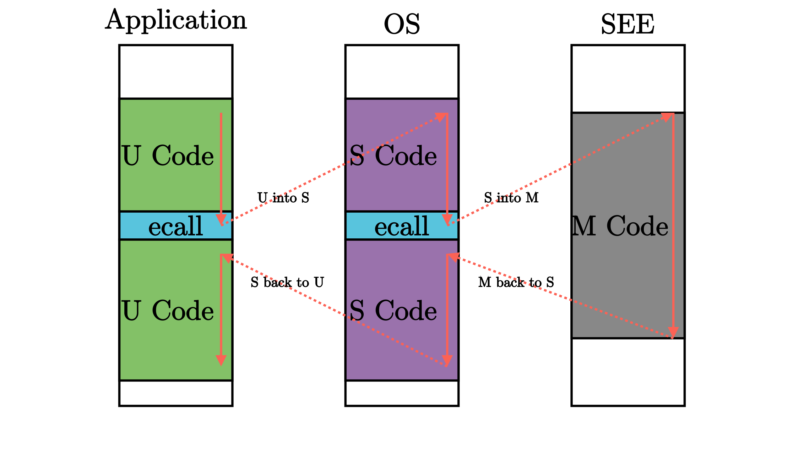

# rCore 实验 - Lab2

位于 ch2 分支上项目结构如下所示：

```bash
./os/src
Rust        13 Files   372 Lines
Assembly     2 Files    58 Lines

├── bootloader
│   └── rustsbi-qemu.bin
├── LICENSE
├── os
│   ├── build.rs(新增：生成 link_app.S 将应用作为一个数据段链接到内核)
│   ├── Cargo.toml
│   ├── Makefile(修改：构建内核之前先构建应用)
│   └── src
│       ├── batch.rs(新增：实现了一个简单的批处理系统)
│       ├── console.rs(将打印字符的 SBI 接口进一步封装实现更加强大的格式化输出)
│       ├── entry.asm(设置内核执行环境的一段汇编代码)
│       ├── lang_items.rs(需要我们提供给 Rust 编译器的一些语义项，包含内核 panic 时的处理逻辑)
│       ├── link_app.S(构建产物，由 os/build.rs 输出)
│       ├── linker-qemu.ld(控制内核内存布局的链接脚本以使得内核运行在 qemu 虚拟机上)
│       ├── main.rs(修改：主函数中需要初始化 Trap 处理并加载和执行应用)
│       ├── sbi.rs(调用底层 SBI 实现提供的 SBI 接口)
│       ├── sync(新增：同步子模块 sync ，目前唯一功能是提供 UPSafeCell)
│       │   ├── mod.rs
│       │   └── up.rs(包含 UPSafeCell，它可以帮助我们以更 Rust 的方式使用全局变量)
│       ├── syscall(新增：系统调用子模块 syscall)
│       │   ├── fs.rs(包含文件 I/O 相关的 syscall)
│       │   ├── mod.rs(提供 syscall 方法根据 syscall ID 进行分发处理)
│       │   └── process.rs(包含任务处理相关的 syscall)
│       └── trap(新增：Trap 相关子模块 trap)
│           ├── context.rs(包含 Trap 上下文 TrapContext)
│           ├── mod.rs(包含 Trap 处理入口 trap_handler)
│           └── trap.S(包含 Trap 上下文保存与恢复的汇编代码)
├── README.md
├── rust-toolchain(控制整个项目的工具链版本)
└── user(新增：应用测例保存在 user 目录下)
   ├── Cargo.toml
   ├── Makefile
   └── src
      ├── bin(基于用户库 user_lib 开发的应用，每个应用放在一个源文件中)
      │   ├── 00hello_world.rs
      │   ├── 01store_fault.rs
      │   ├── 02power.rs
      │   ├── 03priv_inst.rs
      │   └── 04priv_csr.rs
      ├── console.rs
      ├── lang_items.rs
      ├── lib.rs(用户库 user_lib)
      ├── linker.ld(应用的链接脚本)
      └── syscall.rs(包含 syscall 方法生成实际用于系统调用的汇编指令，
                     各个具体的 syscall 都是通过 syscall 来实现的)
```

## 特权级机制

### RISC-V 的指令

| 指令         | 含义                                                   |
| ------------ | ------------------------------------------------------ |
| `call`       | **伪指令**，用于函数调用，子程序跳转                   |
| `ecall`      | **基础指令**，用于触发从用户模式到更高特权级的软中断   |
| `ret`        | **伪指令**，用于从函数调用处返回                       |
| `sret`       | **特权级指令**，用于从 S-Mode 的异常和中断处理程序返回 |
| `eret`       | **最高特权级指令**，用于从 M-Mode 的异常和中断程序返回 |
| `wfi`        | **特权级指令**，处理器在空闲时进入低功耗状态等待中断   |
| `sfence.vma` | **特权级指令**，刷新 TLB 缓存                          |

### 特权级软硬件协同设计

低特权级软件只能做高特权级允许它做的，且超出低特权级软件能力的功能必须寻求高特权级软件的帮助，高特权级软件（操作系统）称为低特权级软件（一般软件）的软件执行环境的重要组成部分。

为实现这样的特权级机制，需要软硬件协同设计。

### RISC-V 特权级架构

| 级别 | 编码 | 名称                                |
| ---- | ---- | ----------------------------------- |
| 0    | 00   | 用户/应用模式 (U, User/Application) |
| 1    | 01   | 监督模式 (S, Supervisor)            |
| 2    | 10   | 虚拟监督模式 (H, Hypervisor)        |
| 3    | 11   | 机器模式 (M, Machine)               |

本系列实验设计实现 RISC-V 的 M/S/U 三种特权级：
- **U 模式**：应用程序和用户态支持库运行在 U-Mode 的最低特权级。
- **S 模式**：操作系统内核运行在 S-Mode 特权级，形成支持应用程序和用户态支持库的执行环境。
- **M 模式**：RustSBI 运行在更底层的 M-Mode 特权级，是操作系统内核的执行环境。

