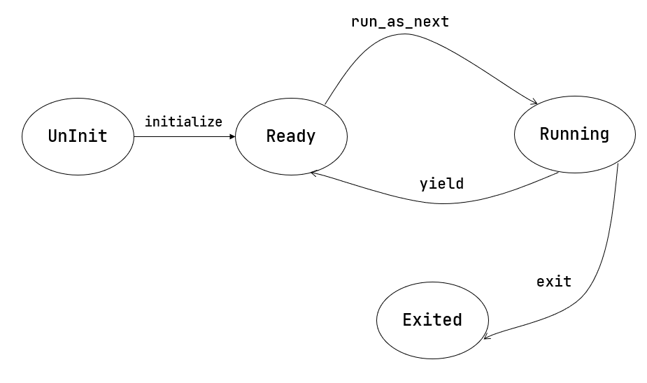

# rCore实验 - Lab3

```bash
git checkout ch3-coop 	# 切换多道程序分支
git checkout ch3 		# 切换分时多任务程序分支
```

代码树：

```bash
./os/src
 2Rust        18 Files   511 Lines
 3Assembly     3 Files    82 Lines
 
├── bootloader(内核依赖的运行在 M 特权级的 SBI 实现，本项目中我们使用 RustSBI)
│   └── rustsbi-qemu.bin(可运行在 qemu 虚拟机上的预编译二进制版本)
├── LICENSE
├── os
│   ├── build.rs
│   ├── Cargo.toml
│   ├── Makefile
│   └── src
│       ├── batch.rs(移除：功能分别拆分到 loader 和 task 两个子模块)
│       ├── config.rs(新增：保存内核的一些配置)
│       ├── console.rs
│       ├── entry.asm
│       ├── lang_items.rs
│       ├── link_app.S
│       ├── linker-qemu.ld
│       ├── loader.rs(新增：将应用加载到内存并进行管理)
│       ├── main.rs(修改：主函数进行了修改)
│       ├── sbi.rs(修改：引入新的 sbi call set_timer)
│       ├── sync
│       │   ├── mod.rs
│       │   └── up.rs
│       ├── syscall(修改：新增若干 syscall)
│       │   ├── fs.rs
│       │   ├── mod.rs
│       │   └── process.rs
│       ├── task(新增：task 子模块，主要负责任务管理)
│       │   ├── context.rs(引入 Task 上下文 TaskContext)
│       │   ├── mod.rs(全局任务管理器和提供给其他模块的接口)
│       │   ├── switch.rs(将任务切换的汇编代码解释为 Rust 接口 __switch)
│       │   ├── switch.S(任务切换的汇编代码)
│       │   └── task.rs(任务控制块 TaskControlBlock 和任务状态 TaskStatus 的定义)
│       ├── timer.rs(新增：计时器相关)
│       └── trap
│           ├── context.rs
│           ├── mod.rs(修改：时钟中断相应处理)
│           └── trap.S(包含 Trap 上下文保存与恢复的汇编代码)
├── README.md
├── rust-toolchain
└── user
    ├── build.py(新增：使用 build.py 构建应用使得它们占用的物理地址区间不相交)
    ├── Cargo.toml
    ├── Makefile(修改：使用 build.py 构建应用)
    └── src
        ├── bin(修改：换成第三章测例)
        │   ├── 00power_3.rs
        │   ├── 01power_5.rs
        │   ├── 02power_7.rs
        │   └── 03sleep.rs
        ├── console.rs
        ├── lang_items.rs
        ├── lib.rs
        ├── linker.ld
        └── syscall.rs
```

## 多道程序放置

### 多道程序放置

通过 `build.py` 脚本为每个用户态应用程序定制了各自的链接脚本（生成不同内存地址）：

```python
# user/build.py
import os

# 内存地址配置
base_address = 0x80400000   # 应用程序的起始加载地址(基地址)
step = 0x20000              # 每个应用程序之间的地址间隔(128KB)
linker = 'src/linker.ld'    # 链接脚本路径

app_id = 0      # 应用程序计数器，用于计算每个应用的加载地址 
# 获取src/bin目录下所有应用程序文件并排序
apps = os.listdir('src/bin')
apps.sort()     # 按文件名排序以保证构建顺序一致

# 遍历处理每个应用程序
for app in apps:
    app = app[:app.find('.')] # 提取纯应用程序名(去掉.扩展名)
    
    # 准备用于修改和恢复链接脚本的缓冲区
    lines = []                # 存储修改后的链接脚本内容
    lines_before = []         # 存储原始链接脚本内容(用于恢复)
    with open(linker, 'r') as f:
        for line in f.readlines():
            lines_before.append(line)   # 保存原始内容
            # 替换基地址为当前应用的特定地址(基地址 + 步长×应用ID)
            line = line.replace(hex(base_address), hex(base_address+step*app_id))
            lines.append(line) # 保存修改后的内容
    # 写入修改后的链接脚本
    with open(linker, 'w+') as f:
        f.writelines(lines)
    # 使用cargo构建当前应用程序(发布模式)
    os.system('cargo build --bin %s --release' % app)
    # 打印构建信息(应用名和加载地址)
    print('[build.py] application %s start with address %s' %(app, hex(base_address+step*app_id)))
    # 恢复原始链接脚本内容(不影响下一个应用的构建)
    with open(linker, 'w+') as f:
        f.writelines(lines_before)
    app_id = app_id + 1

```

- 第 21~29 行：找到 `src/linker.ld` 中的 `BASE_ADDRESS = 0x80400000;` 这一行，将后面的地址替换为和当前应用相对应的一个地址 `base_address + step * appid`

### 多道程序加载

所有应用在内核初始化时一并加载到内存，为避免覆盖，通过调用 `loader` 子模块的 `load_app` 函数实现将不同应用加载到不同的物理地址：

```rust
// os/src/loader.rs

// 计算方式:
// - 基础地址: APP_BASE_ADDRESS + 应用ID: app_id × 每个应用的大小限制: APP_SIZE_LIMIT
// - 确保每个应用有固定的内存空间且不会重叠
fn get_base_i(app_id: usize) -> usize {
    APP_BASE_ADDRESS + app_id * APP_SIZE_LIMIT
}

pub fn load_apps() {
    // 声明外部函数 _num_app，该函数由链接脚本提供
    unsafe extern "C" {
        // safe属性向编译器保证尽管该函数在 unsafe 块中声明，
        // 但它的调用不会违反 Rust 的内存安全规则
        safe fn _num_app(); 
    }
    // 获取应用程序数量信息的指针
    let num_app_ptr = _num_app as usize as *const usize;
    // 获取应用程序总数
    let num_app = get_num_app();
    // 获取每个应用程序的起始地址
    let app_start = unsafe { core::slice::from_raw_parts(num_app_ptr.add(1), num_app + 1) };
    
    // 加载每个应用程序到内存
    for i in 0..num_app {
        // 计算当前应用程序的基地址
        let base_i = get_base_i(i);

        // 清空应用程序内存区域
        (base_i..base_i + APP_SIZE_LIMIT)
            .for_each(|addr| unsafe { (addr as *mut u8).write_volatile(0) });
        
        // 从内核数据段加载应用程序代码到内存
        // 参数1：应用程序代码起始地址
        // 参数2：应用程序代码长度
        let src = unsafe {
            core::slice::from_raw_parts(app_start[i] as *const u8, app_start[i + 1] - app_start[i])
        };
        // 参数1：目标内存地址
        // 参数2：要拷贝的长度
        let dst = unsafe { core::slice::from_raw_parts_mut(base_i as *mut u8, src.len()) };

        // 执行实际的内存拷贝
        dst.copy_from_slice(src);
    }
    // 执行内存屏障指令，确保后续指令获取能看到之前的所有内存写入
    // 这是RISC-V架构的要求，特别是在修改了指令内存后
    unsafe {
        asm!("fence.i");
    }
}
```

## 任务切换

应用程序在不同时间段的执行过程可分为**两类**：

- 占有处理器执行有效任务的**计算阶段**
- 不必占有处理器的**等待阶段**

### 任务

> **任务**：应用程序的一次执行过程（一段控制流）。

- **计算任务片**：应用程序执行过程中一个时间片段上的**执行片段**。

- **空闲任务片**：应用程序执行过程中一个时间片段上的**空闲片段**。

- **任务切换**：从一个程序的任务切换到另一个程序的任务。
- **任务上下文**：任务切换过程中需要被保存和恢复的资源。

### 任务切换的设计与实现

`switch.S` 实现了一个任务上下文切换器，用于保存当前任务的执行上下文、恢复下一个任务的执行上下文，实现任务的无缝切换。

```asm
# os/src/task/switch.S

.altmacro           # 启用高级宏模式，允许在宏中使用更复杂的参数

# 定义保存寄存器 s{n} 的宏
# 参数n: 寄存器编号（0-11对应s0-s11）
.macro SAVE_SN n
    sd s\n, (\n+2)*8(a0)
.endm

# 定义加载寄存器 s{n} 的宏

.macro LOAD_SN n
    ld s\n, (\n+2)*8(a1) # 从 a1+offset 处加载数据到寄存器 s{n}
.endm


    .section .text  # 定义代码段
    .globl __switch # 声明 __switch 为全局符号
__switch:
	# 阶段[1]
    # 函数参数:
    # a0: 当前任务上下文指针(current_task_cx_ptr)
    # a1: 下一个任务上下文指针(next_task_cx_ptr)
	
	# 阶段[2]
    # 保存当前任务的内核栈指针
    sd sp, 8(a0) # 将sp保存到a0+8的位置
    # 保存当前执行的返回地址(ra)和保存寄存器(s0-s11)
    sd ra, 0(a0)
    # 循环保存s0-s11寄存器
    .set n, 0           # 初始化计数器n=0
    .rept 12            # 重复12次(对应s0-s11)
        SAVE_SN %n      # 调用SAVE_SN宏保存寄存器
        .set n, n + 1   # 计数器递增
    .endr
	
	# 阶段[3]
    # 恢复下一个执行的返回地址和保存寄存器
    ld ra, 0(a1)
    # 循环加载s0-s11寄存器
    .set n, 0           # 重置计数器n=0
    .rept 12            # 重复12次
        LOAD_SN %n      # 调用LOAD_SN宏加载寄存器
        .set n, n + 1   # 计数器递增
    .endr
    # 恢复下一个任务的内核栈指针
    ld sp, 8(a1)        # 从a1+8的位置加载sp
    
    # 阶段[4]
    ret                 # 返回(使用刚恢复的ra)
```

- **阶段[1]**：函数原型中的两个参数分别是 **当前 A 任务上下文指针** `current_task_cx_ptr` 和 **即将被切换到的 B 任务的上下文指针** `next_task_cx_ptr` 。
- **阶段[2]**：将当前 CPU 状态保存到 A 任务上下文。
- **阶段[3]**：根据 B 任务上下文保存的内容来恢复上诉 CPU 状态。

任务上下文 `TaskContext` 中保存寄存器如下：

```rust
// os/src/task/context.rs

pub struct TaskContext {
    // 返回地址（存储__switch函数返回后要跳转的地址，通常是__restore）
    // 类型：usize（指针大小的无符号整数）
    ra: usize,
    // 应用程序的内核栈指针
    // 用于任务切换时恢复正确的内核栈位置
    sp: usize,
    // 被调用者保存的寄存器组（s0-s11）
    // RISC-V调用约定中这些寄存器在函数调用间必须保持不变
    // 数组大小固定为12（对应s0-s11）
    s: [usize; 12],
}
```

- `ra`：记录 `__switch` 函数返回之后要跳转到的地址，从而在任务切换完成并 `ret` 之后能到达正确的位置。
- `s`：一般 Rust 函数会在起始位置自动生成代码保存 `s0-s11` 这些被调用者保存的寄存器，然而 `_switch` 是汇编代码写成的特殊函数，需要手动编写处理保存。

将汇编代码全局符号 `__switch` 在 Rust 代码中解释为一个函数：

```rust
// os/src/task/switch.rs

use super::TaskContext;

// 嵌入汇编代码文件switch.S的内容
// 该文件包含实际的上下文切换汇编实现
global_asm!(include_str!("switch.S"));

// 声明外部汇编函数__switch的Rust接口
unsafe extern "C" {
    /// 切换到next_task_cx_ptr指向的上下文
    /// 同时将当前上下文保存到current_task_cx_ptr
    pub unsafe fn __switch(
        current_task_cx_ptr: *mut TaskContext,  // 当前任务上下文保存位置
        next_task_cx_ptr: *const TaskContext,   // 要切换到的任务上下文
    );
}
```

在实际使用中，通过调用该函数来让 Rust 编译器自动帮助我们插入 保存/恢复 调用者保存寄存器的汇编代码，而不是直接跳转到 `__switch` 的地址。

## 多道程序与协作式调度



- 任务运行状态：未初始化、准备执行、正在执行、已退出
- 任务控制块：管理程序的执行过程的任务上下文，控制程序的执行与暂停
- 任务相关系统调用：应用程序和操作系统之间的接口，用于程序主动暂停 `sys_yield` 和 主动退出 `sys_exit`

### yield 系统调用

`sys_yield` 标准接口：

```rust
// os/src/syscall/process.rs

// 当前任务主动放弃CPU使用权
// 返回值: 总是返回0表示成功
// syscall ID: 124
pub fn sys_yield() -> isize;
```

用户库对应的实现与封装：

```rust
// user/src/syscall/rs

// 用户态主动让出CPU控制权的系统调用 
pub fn sys_yield() -> isize {
    // 调用底层syscall函数，参数全置0
    syscall(SYSCALL_YIELD, [0, 0, 0])
}

// user/src/lib.rs
pub fn yield_() -> isize {
    sys_yield()
}
```

### 任务控制块与运行状态

在内核中维护应用的几种运行状态：

```rust
// os/src/task/task.rs

#[derive(Copy, Clone, PartialEq)]
pub enum TaskStatus {
    UnInit,     // 未初始化状态（任务刚创建但未准备好）
    Ready,      // 就绪状态（可被调度执行）
    Running,    // 运行状态（当前正在CPU上执行）
    Exited,     // 已退出状态（任务执行完成）
}
```

在内核的**任务控制块**（Task Control Block）中保存其它应用信息：

```rust
// os/src/task/task.rs

// 任务控制块(TCB)结构体，用于管理任务的核心元数据
#[derive(Copy, Clone)]
pub struct TaskControlBlock {
    // 当前任务状态（就绪/运行/退出等）
    pub task_status: TaskStatus,
    // 任务上下文信息（保存寄存器等执行状态）
    pub task_cx: TaskContext,
}
```

### 任务管理器

通过全局任务管理器来管理多个应用：

```rust
// os/src/task/mod.rs

// 任务管理器结构体，负责管理系统中所有任务
pub struct TaskManager {
    // 系统中应用程序总数
    num_app: usize,
    // 内部可变性封装的任务管理器核心数据
    // 通过exclusive_access()方法获取可变引用
    inner: UPSafeCell<TaskManagerInner>,
}

// 任务管理器的核心数据结构
// 包含所有任务的控制块和当前运行任务信息
pub struct TaskManagerInner {
    // 任务控制块数组
    // 每个元素对应一个应用程序的执行状态
    tasks: [TaskControlBlock; MAX_APP_NUM],
    // 当前正在运行的任务ID（数组索引）
    current_task: usize,
}
```

- `num_app`：表示任务管理器管理的应用数目，在 `TaskManager` 初始化之后不再发生改变
- `current_task`：表示 CPU 正在执行的应用编号，在执行应用的过程中发生改变

**重扩展初始化 `TaskManager` 的全局示例 `TASK_MANAGER`：**

```rust
// os/src/task/mod.rs

// 全局任务管理器初始化（lazy_static宏实现）
//
// 在首次访问时执行初始化，创建包含所有应用任务的控制块
lazy_static! {
    /// 全局任务管理器实例（线程安全）
    pub static ref TASK_MANAGER: TaskManager = {
        // 获取应用程序数量
        let num_app = get_num_app();

        // 初始化任务控制块数组
        let mut tasks = [TaskControlBlock {
            task_cx: TaskContext::zero_init(),  // 初始化为零值的任务上下文
            task_status: TaskStatus::UnInit,    // 初始状态设为未初始化
        }; MAX_APP_NUM];

        // 为每个应用程序设置初始状态
        for (i, task) in tasks.iter_mut().enumerate() {
            // 初始化任务上下文（指向恢复地址和内核栈）
            task.task_cx = TaskContext::goto_restore(init_app_cx(i));
            // 设置任务状态为就绪
            task.task_status = TaskStatus::Ready;
        }

        // 构造最终的任务管理器实例
        TaskManager {
            num_app,    // 记录应用数量
            inner: unsafe {
                // 使用UPSafeCell包装内部数据（保证线程安全）
                UPSafeCell::new(TaskManagerInner {
                    tasks,              // 初始化后的任务数组
                    current_task: 0,    // 默认从第一个任务开始执行
                })
            },
        }
    };
}
```

### 实现 sys_yield 和 sys_exit 系统调用

- `sys_yield`：表示应用自己暂时放弃对 CPU 的当前使用权，进入 `Ready` 状态。

```rust
// os/src/syscall/process.rs
use crate::task::suspend_current_and_run_next;

pub fn sys_yield() -> isize {
    suspend_current_and_run_next(); // 暂停当前的应用并切换到下个应用
    0
}
```

- `sys_exit`：表示应用退出执行

```rust
// os/src/syscall/process.rs

use crate::task::exit_current_and_run_next;

// 任务退出系统调用
pub fn sys_exit(exit_code: i32) -> ! {
    // 打印带状态码的退出信息
    println!("[kernel] Application exited with code {}", exit_code);
    exit_current_and_run_next(); 		// 终止当前任务并运行下一个就绪任务
    panic!("Unreachable in sys_exit!"); // 编译器提示（实际不会执行到这里）
}
```

- 实现 `suspend_current_and_run_next()` 和 `exit_current_and_run_next()`

```rust
// os/src/task/mod.rs

// 挂起当前任务并切换到下一个就绪任务
pub fn suspend_current_and_run_next() {
    mark_current_suspended();   // 标记当前任务为挂起状态
    run_next_task();            // 执行任务切换
}

// 终止当前任务并切换到下一个就绪任务
pub fn exit_current_and_run_next() {
    mark_current_exited();      // 标记当前任务为退出状态
    run_next_task();            // 执行任务切换
}

// 执行任务切换：通过全局任务管理器切换到下一个就绪任务
fn run_next_task() {
    TASK_MANAGER.run_next_task();           // 调用任务管理器的任务切换逻辑
}

// 标记当前任务为挂起状态：将当前运行任务状态从Running改为Ready
fn mark_current_suspended() {
    TASK_MANAGER.mark_current_suspended();  // 调用任务管理器的状态变更方法
}

// 标记当前任务为退出状态：将当前运行任务状态从Running改为Exited
fn mark_current_exited() {
    TASK_MANAGER.mark_current_exited();     // 调用任务管理器的状态变更方法
}


impl TaskManager {
    // 将当前运行任务状态改为Ready（挂起状态）
    fn mark_current_suspended(&self) {
        let mut inner = self.inner.exclusive_access();          // 获取内部数据的可变引用
        let current = inner.current_task;                       // 当前任务ID
        inner.tasks[current].task_status = TaskStatus::Ready;   // 更新状态
    }

    // 将当前运行任务状态改为Exited（退出状态）
    fn mark_current_exited(&self) {
        let mut inner = self.inner.exclusive_access();          // 获取内部数据的可变引用
        let current = inner.current_task;                       // 当前任务ID
        inner.tasks[current].task_status = TaskStatus::Exited;  // 更新状态
    }
    
    // 查找下一个可运行的任务
    fn find_next_task(&self) -> Option<usize> {
        // 获取任务管理器的独占访问权
        let inner = self.inner.exclusive_access();
        // 获取当前运行任务的ID
        let current = inner.current_task;

        // 生成环形查找范围：
        // 1. 从current+1开始到current+num_app+1（保证覆盖整个环形范围）
        // 2. 通过取模运算实现环形索引
        (current + 1..current + self.num_app + 1)
            .map(|id| id % self.num_app)    // 环形索引转换
            .find(|id| inner.tasks[*id].task_status == TaskStatus::Ready) // 查找第一个就绪任务
    }
    
    // 切换到下一个就绪任务或结束系统运行
    fn run_next_task(&self) {
        // 查找下一个可运行的任务
        if let Some(next) = self.find_next_task() {
            // 获取任务管理器内部数据的可变引用
            let mut inner = self.inner.exclusive_access();

            // 更新任务状态：
            let current = inner.current_task;
            inner.tasks[next].task_status = TaskStatus::Running;    // 新任务设为运行状态
            inner.current_task = next;                              // 更新当前任务ID

            // 准备上下文切换指针：
            let current_task_cx_ptr = &mut inner.tasks[current].task_cx as *mut TaskContext;
            let next_task_cx_ptr = &inner.tasks[next].task_cx as *const TaskContext;

            // 释放内部数据锁
            drop(inner);
            // before this, we should drop local variables that must be dropped manually

            // 执行上下文切换（汇编实现）
            unsafe {
                __switch(current_task_cx_ptr, next_task_cx_ptr);
            }
            // 切换后控制流会跳转到新任务
        } else {
            // 没有就绪任务时的处理
            println!("All applications completed!");
            shutdown(false); // 关闭系统
        }
    }
}
```

- `drop(inner)`：在实际切换之前，需要手动 drop 掉获取到的 `TaskManagerInner` 的来自 `UPSafeCell` 的借用标记。

### 第一次进入用户态

```rust
// os/src/task/mod.rs

// 为每个应用程序设置初始状态
for (i, task) in tasks.iter_mut().enumerate() {
    // 初始化任务上下文（指向恢复地址和内核栈）
    task.task_cx = TaskContext::goto_restore(init_app_cx(i));
    // 设置任务状态为就绪
    task.task_status = TaskStatus::Ready;
}

// os/src/task/context.rs
impl TaskContext {
    // 创建指向__restore的任务上下文
    pub fn goto_restore(kstack_ptr: usize) -> Self {
        unsafe extern "C" {
            unsafe fn __restore();  // 声明外部恢复函数
        }
        Self {
            ra: __restore as usize, // 设置返回地址为__restore
            sp: kstack_ptr,         // 设置内核栈指针
            s: [0; 12],             // 寄存器初始化为零
        }
    }
}

// os/src/loader.rs
// 初始化应用程序上下文
pub fn init_app_cx(app_id: usize) -> usize {
    KERNEL_STACK[app_id].push_context(TrapContext::app_init_context(
        get_base_i(app_id),     // 获取应用程序基地址
        USER_STACK[app_id].get_sp(),   // 获取用户栈指针
    ))
}
```

1. 对于每个任务，首先调用 `init_app_cx` 构造该任务的上下文（包括入口地址和用户栈指针），然后将其压入到内核栈顶。
2. 接着调用 `TaskContext::goto_restore` 来构造每个任务保存在任务控制块中的任务上下文。
   - 任务上下文中的内核栈指针将任务上下文的 `ra` 寄存器设置为 `__restore` 的入口地址；

在 `rust_main` 中调用 `task::run_first_task` 开始应用的执行：

```rust
// os/src/task/mod.rs

// 运行第一个任务（系统启动入口）
pub fn run_first_task() {
    TASK_MANAGER.run_first_task(); // 通过全局任务管理器启动第一个任务
}

impl TaskManager {
    // 运行任务列表中的第一个任务
    fn run_first_task(&self) -> ! {
        // 获取任务管理器内部数据的可变引用
        let mut inner = self.inner.exclusive_access();

        // 获取第一个任务的控制块
        let task0 = &mut inner.tasks[0];
        task0.task_status = TaskStatus::Running; // 设置任务状态为运行中

        // 获取任务上下文指针
        let next_task_cx_ptr = &task0.task_cx as *const TaskContext;

        // 释放内部数据锁
        drop(inner);

        // 创建临时上下文用于切换
        let mut _unused = TaskContext::zero_init();
        // 执行上下文切换（汇编实现）
        unsafe {
            __switch(&mut _unused as *mut TaskContext, next_task_cx_ptr);
        }
        // 永远不会执行到这里
        panic!("unreachable in run_first_task!");
    }    
}
```

## 分时多任务系统与抢占式调度

**进一步对任务的概念继续扩展**：

- **分时多任务**：操作系统管理每个应用程序，以时间片为单位来分时占有处理器运行应用。
- **时间片轮转调度**：操作系统在一个程序用完其时间片后，就抢占当前程序并调用下一个程序执行，周而复始，形成对应用程序在任务级别上的时间片轮转调度。

### RISC-V 架构的中断

**RISC-V 架构定义了如下中断**：

| 中断 | 异常码 | 描述                          |
| ---- | ------ | ----------------------------- |
| 1    | 1      | Supervisor software interrupt |
| 1    | 3      | Machine software interrupt    |
| 1    | 5      | Supervisor timer interrupt    |
| 1    | 7      | Machine timer interrupt       |
| 1    | 9      | Supervisor external interrupt |
| 1    | 11     | Machine external interrupt    |

- **软件中断**（Software Interrupt）：由软件控制发出的中断。
- **时钟中断**（Timer Interrupt）：由时钟电路发出的中断。
- **外部中断**（External Interrupt）：由外设发出的中断。

**判断中断是否会被屏蔽规则如下**：

- 如果中断的特权级 **低于** CPU 当前的特权级，则该中断会被屏蔽，不会被处理；
- 如果中断的特权级 **高于** CPU 当前的特权级或**相同**，则需要相应的 CSR 判断该中断是否会被屏蔽。

**中断产生后硬件将完成如下事务**：

- 当中断发生时，`sstatus.sie` 字段会被保存在 `sstatus.spie` 字段中，同时把 `sstatus.sie` 字段置零，这样软件在进行后续的中断处理过程中，所有 S 特权级的中断都会被屏蔽；
- 当软件执行中断处理完毕后，会执行 `sret` 指令返回到被中断打断的地方继续执行，硬件会把 `sstatus.sie` 字段恢复为 `sstatus.spie` 字段内的值。

### 时钟中断与计时器

**获取计数器 `mtime` 的值**：

```rust
// os/src/timer.rs

use riscv::register::time;

pub fn get_time() -> usize {
    time::read()
}
```

**计时器的控制**：

```rust
// os/src/sbi.rs

const SBI_SET_TIMER: usize = 0;

// 通过SBI调用设置定时器
pub fn set_timer(timer: usize) {
    sbi_call(SBI_SET_TIMER, timer, 0, 0);
}

// os/src/timer.rs
use crate::config::CLOCK_FREQ;
const TICKS_PER_SEC: usize = 100;

// 设置下一次定时器中断触发时间
// 计算方式：当前时间 + (时钟频率 / 每秒触发次数)
// 这样会确保定时器每秒触发 `TICKS_PER_SEC` 次
pub fn set_next_trigger() {
    set_timer(get_time() + CLOCK_FREQ / TICKS_PER_SEC);
}
```

- `sbi` 子模块有一个 `set_timer` 调用，是一个由 SEE 提供的标准 SBI 接口函数，可以用来设置 `mtimecmp` 的值。
- `timer` 子模块的 `set_next_trigger` 函数对 `set_timer` 进行封装，读取 `mtime` 的值，然后计算出 10ms 之内计数器的增量，再将 `mtimecmp` 设置为两者之和。这样，10 ms 之后一个 S 特权级时钟中断就会被触发。

**统计一个应用的运行时长**：

```rust
// os/src/timer.rs

// 每秒的微秒数
#[allow(dead_code)]
const MICRO_PER_SEC: usize = 1_000_000;

// 获取当前计数器的值(微秒级为单位)
// (time寄存器值 × 每秒微秒数) / 时钟频率
#[allow(dead_code)]
pub fn get_time_us() -> usize {
    time::read() * MICRO_PER_SEC / CLOCK_FREQ
}
```

**增加获取当前时间的系统调用**：

```rust
// os/src/syscall/process.rs

// 功能：获取当前的时间，保存在 TimeVal 结构体 ts 中，_tz 在我们的实现中忽略
// 返回值：返回是否执行成功，成功则返回 0
// syscall ID：169
pub fn sys_get_time(ts: *mut TimeVal, _tz: usize) -> isize;

#[repr(C)] // 指定结构体使用C语言的内存布局
pub struct TimeVal {
    pub sec: usize,     // 秒数部分
    pub usec: usize,    // 微秒部分
}
```

### 抢占式调度

**抢占式调度实现**：

```rust
// os/src/trap/mod.rs

pub fn trap_handler(cx: &mut TrapContext) -> &mut TrapContext {
    match scause.cause() {
        	// ...
            Trap::Interrupt(Interrupt::SupervisorTimer) => {
            set_next_trigger();
            suspend_current_and_run_next();
        }
    }
}
```

在 `trap_handler` 函数下新增一个条件分支跳转，当触发一个 S 特权级时钟中断时。首先设置一个 10 ms 的计时器，然后调用 `suspend_current_and_run_next()` 函数暂停当前应用并切换到下一个。

**为防止 S 特权级时钟中断被屏蔽，在执行第一个应用时进行初始化设置**：

```rust
// os/src/main.rs

#[unsafe(no_mangle)]
pub fn rust_main() -> ! {
	// ...
    trap::enable_timer_interrupt(); // 在 S 模式开启时钟中断
    timer::set_next_trigger();		// 设置下一次定时器中断触发时间
    task::run_first_task();	
}

// os/src/trap/mod.rs

use riscv::register::sie;

pub fn enable_timer_interrupt() {
    unsafe {
        sie::set_stimer();
    }
}
```

- `trap::enable_timer_interrupt()`：设置了 `sie.stie` 使得 S 特权级时钟中断不会被屏蔽。
- `timer::set_next_trigger()`：设置第一个 10 ms 的计时器。

**主动 yield 来优化轮询过程中带来的CPU资源浪费：**

```rust
user/src/bin/03sleep.rs

// 等待3000ms然后退出
#[no_mangle]
fn main() -> i32 {
    let current_time = get_time();
    assert!(current_time > 0);
    println!("get_time OK! {}", current_time);
    let wait_for = current_time + 3000;
    while get_time() < wait_for {
        yield_();
    }
    println!("Test sleep OK!");
    0
}
```

